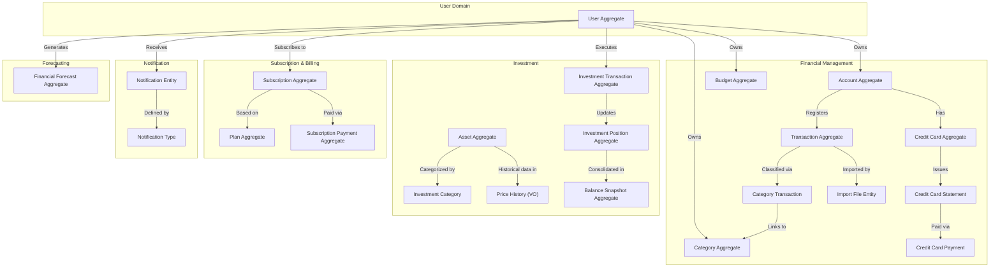

# Domain & DDD - ValorizeAI

Este documento descreve os principais domínios e bounded contexts do sistema, de acordo com os princípios do Domain-Driven Design (DDD).

## Bounded Contexts

- **Identity Context**  
  Contém as entidades relacionadas à identificação e gerenciamento de usuários e grupos.  
  **Entidades:**  
  - **User**  
  - **FinancialGroup** (parte do Identity)  
  - **GroupMember**

- **Core Finance Context**  
  Abrange as operações centrais de finanças.  
  **Entidades:**  
  - **Account**  
  - **Transaction**  
  - **Budget**  
  - **Category**

- **Investments Context**  
  Gerencia os investimentos dos usuários, desde a definição de categorias até o histórico de preços.  
  **Entidades:**  
  - **InvestmentCategory**  
  - **Asset**  
  - **PriceHistory**  
  - **InvestmentTransaction**  
  - **InvestmentPosition**

- **Credit Card Context**  
  Focado no gerenciamento de cartões de crédito, faturas e pagamentos.  
  **Entidades:**  
  - **CreditCard**  
  - **CreditCardStatement**  
  - **CreditCardPayment**

- **Subscription & Billing Context**  
  Responsável por gerenciar os planos de assinatura e pagamentos via Stripe.  
  **Entidades:**  
  - **Plan**  
  - **Subscription**  
  - **SubscriptionPayment**

- **Import Context**  
  Trata da importação de dados financeiros de arquivos externos (OFX, CSV).  
  **Entidades:**  
  - **ImportFile**

- **Notification Context**  
  Gerencia o envio e registro de notificações aos usuários.  
  **Entidades:**  
  - **NotificationType**  
  - **Notification**

- **Forecasting Context**  
  Responsável por projeções financeiras e análises preditivas.  
  **Entidades:**  
  - **FinancialForecast**

## Diagrama Bounded Contexts (Mermaid)

[Next: [[DatabaseSchema]] |  | [[Architecture]] ]