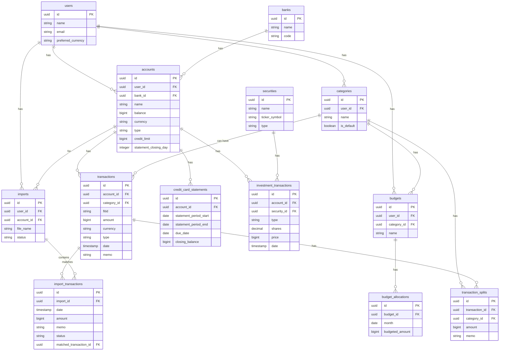

# Schema do Banco de Dados

## 1. Introdução

Este documento detalha o schema do banco de dados PostgreSQL para a aplicação. O design visa a normalização, a integridade dos dados e a escalabilidade para suportar todas as funcionalidades planejadas.

- **Chaves Primárias:** Utilizamos `UUID` como chave primária para a maioria das tabelas para evitar a enumeração de recursos e facilitar a sincronização de dados.
- **Valores Monetários:** Todos os valores monetários são armazenados como inteiros (`integer` ou `bigint`) para representar a menor unidade da moeda (ex: centavos), evitando problemas de precisão com ponto flutuante.

## 2. Diagrama de Entidade e Relacionamento (ERD)

## 3. Definição das Tabelas

### `users`
Armazena as informações dos usuários.

| Coluna | Tipo | Descrição |
| --- | --- | --- |
| `id` | `uuid` | Chave primária. |
| `name` | `varchar` | Nome do usuário. |
| `email` | `varchar` | Email único do usuário. |
| `password` | `varchar` | Hash da senha. |
| `preferred_currency` | `varchar` | Moeda preferida do usuário (ex: `BRL`, `USD`). |

### `banks`
Catálogo de bancos e instituições financeiras.

| Coluna | Tipo | Descrição |
| --- | --- | --- |
| `id` | `uuid` | Chave primária. |
| `name` | `varchar` | Nome do banco. |
| `code` | `varchar` | Código de identificação do banco. |

### `accounts`
Representa as contas dos usuários (corrente, poupança, cartão, investimento).

| Coluna | Tipo | Descrição |
| --- | --- | --- |
| `id` | `uuid` | Chave primária. |
| `user_id` | `uuid` | FK para `users`. |
| `bank_id` | `uuid` | FK para `banks` (opcional). |
| `name` | `varchar` | Nome da conta (ex: "Conta Corrente Nu"). |
| `balance` | `bigint` | Saldo atual em centavos. |
| `currency` | `varchar` | Moeda da conta (ex: `BRL`). |
| `type` | `varchar` | Tipo da conta (`checking`, `savings`, `credit`, `investment`). |
| `credit_limit` | `bigint` | Limite de crédito em centavos (apenas para contas `credit`). |
| `statement_closing_day` | `integer` | Dia do mês do fechamento da fatura (apenas para contas `credit`). |

### `categories`
Categorias para classificar transações e orçamentos.

| Coluna | Tipo | Descrição |
| --- | --- | --- |
| `id` | `uuid` | Chave primária. |
| `user_id` | `uuid` | FK para `users`. Categorias são por usuário. |
| `name` | `varchar` | Nome da categoria (ex: "Alimentação"). |
| `is_default` | `boolean` | Se é uma categoria padrão do sistema. |

### `transactions`
O coração do sistema, armazena todas as movimentações financeiras.

| Coluna | Tipo | Descrição |
| --- | --- | --- |
| `id` | `uuid` | Chave primária. |
| `account_id` | `uuid` | FK para `accounts`. |
| `category_id` | `uuid` | FK para `categories` (opcional, pode ser nulo se a transação for dividida). |
| `fitid` | `varchar` | Financial Institution Transaction ID, para conciliação. |
| `amount` | `bigint` | Valor da transação em centavos. Positivo para entradas, negativo para saídas. |
| `currency` | `varchar` | Moeda da transação. |
| `type` | `varchar` | Tipo (`debit`, `credit`). |
| `date` | `timestamp` | Data e hora da transação. |
| `memo` | `varchar` | Descrição da transação. |

### `transaction_splits`
Permite dividir uma única transação em múltiplas categorias.

| Coluna | Tipo | Descrição |
| --- | --- | --- |
| `id` | `uuid` | Chave primária. |
| `transaction_id` | `uuid` | FK para `transactions`. |
| `category_id` | `uuid` | FK para `categories`. |
| `amount` | `bigint` | Valor alocado para esta parte da divisão. |
| `memo` | `varchar` | Descrição específica desta parte. |

### `imports`
Representa um job de importação de um arquivo de extrato.

| Coluna | Tipo | Descrição |
| --- | --- | --- |
| `id` | `uuid` | Chave primária. |
| `user_id` | `uuid` | FK para `users`. |
| `account_id` | `uuid` | FK para `accounts`. |
| `file_name` | `varchar` | Nome do arquivo importado. |
| `status` | `varchar` | Status do job (`pending_review`, `completed`, `failed`). |

### `import_transactions`
Tabela de staging para transações importadas aguardando revisão.

| Coluna | Tipo | Descrição |
| --- | --- | --- |
| `id` | `uuid` | Chave primária. |
| `import_id` | `uuid` | FK para `imports`. |
| `date` | `timestamp` | Data da transação. |
| `amount` | `bigint` | Valor em centavos. |
| `memo` | `varchar` | Descrição/memo da transação. |
| `fitid` | `varchar` | ID da transação do banco (se disponível). |
| `status` | `varchar` | Status da transação (`pending`, `approved`, `rejected`, `matched`). |
| `matched_transaction_id` | `uuid` | FK para `transactions` se uma correspondência for encontrada. |
| `raw_data` | `jsonb` | Os dados originais da transação como foram extraídos do arquivo. |

### `budgets`
Define as "categorias" ou "envelopes" de orçamento do usuário.

| Coluna | Tipo | Descrição |
| --- | --- | --- |
| `id` | `uuid` | Chave primária. |
| `user_id` | `uuid` | FK para `users`. |
| `category_id` | `uuid` | FK para `categories`. O orçamento é para uma categoria específica. |
| `name` | `varchar` | Nome do orçamento (pode ser o mesmo da categoria). |

### `budget_allocations`
Alocação de valores para um orçamento em um determinado período (mês).

| Coluna | Tipo | Descrição |
| --- | --- | --- |
| `id` | `uuid` | Chave primária. |
| `budget_id` | `uuid` | FK para `budgets`. |
| `month` | `date` | O primeiro dia do mês da alocação (ex: `2025-08-01`). |
| `budgeted_amount` | `bigint` | Valor orçado para o mês em centavos. |

### `credit_card_statements`
Armazena informações das faturas de cartão de crédito.

| Coluna | Tipo | Descrição |
| --- | --- | --- |
| `id` | `uuid` | Chave primária. |
| `account_id` | `uuid` | FK para `accounts` (deve ser uma conta do tipo `credit`). |
| `statement_period_start`| `date` | Data de início do período da fatura. |
| `statement_period_end` | `date` | Data de fechamento da fatura. |
| `due_date` | `date` | Data de vencimento da fatura. |
| `closing_balance` | `bigint` | Saldo devedor no fechamento, em centavos. |

### `securities`
Catálogo de ativos de investimento (ações, FIIs, etc.).

| Coluna | Tipo | Descrição |
| --- | --- | --- |
| `id` | `uuid` | Chave primária. |
| `name` | `varchar` | Nome do ativo (ex: "Banco do Brasil ON"). |
| `ticker_symbol` | `varchar` | Símbolo do ativo (ex: `BBAS3`). |
| `type` | `varchar` | Tipo de ativo (`stock`, `bond`, `etf`, `real_estate_fund`). |

### `investment_transactions`
Transações de compra e venda de ativos.

| Coluna | Tipo | Descrição |
| --- | --- | --- |
| `id` | `uuid` | Chave primária. |
| `account_id` | `uuid` | FK para `accounts` (deve ser uma conta do tipo `investment`). |
| `security_id` | `uuid` | FK para `securities`. |
| `type` | `varchar` | Tipo de transação (`buy`, `sell`, `dividend`, `interest`). |
| `shares` | `decimal` | Quantidade de cotas/ações. |
| `price` | `bigint` | Preço por cota/ação em centavos. |
| `date` | `timestamp` | Data da operação. |
